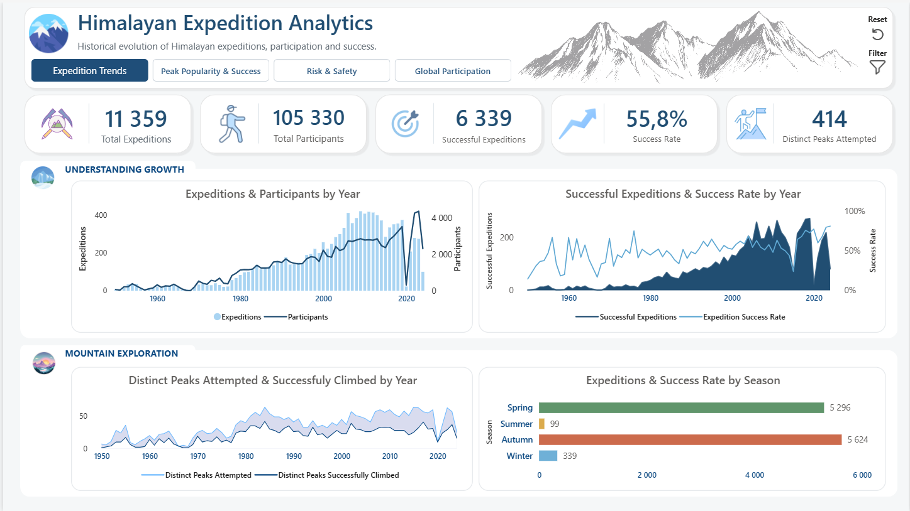
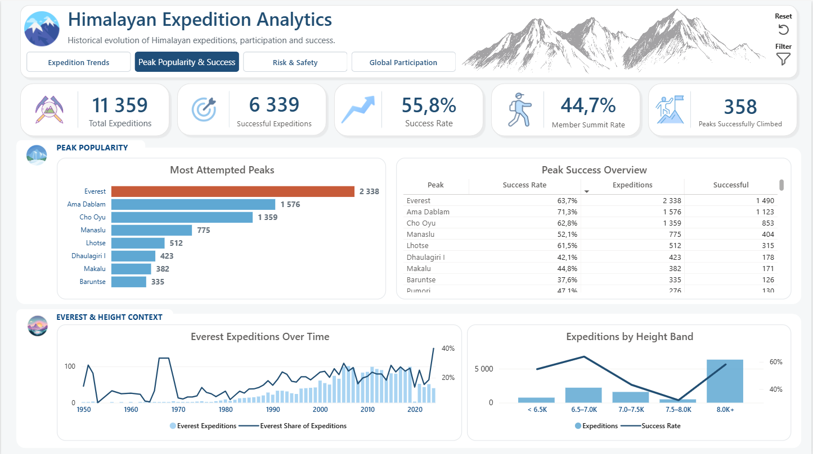
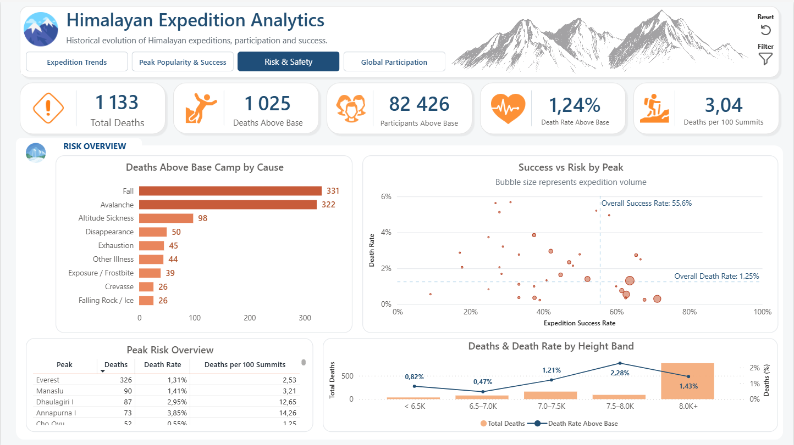
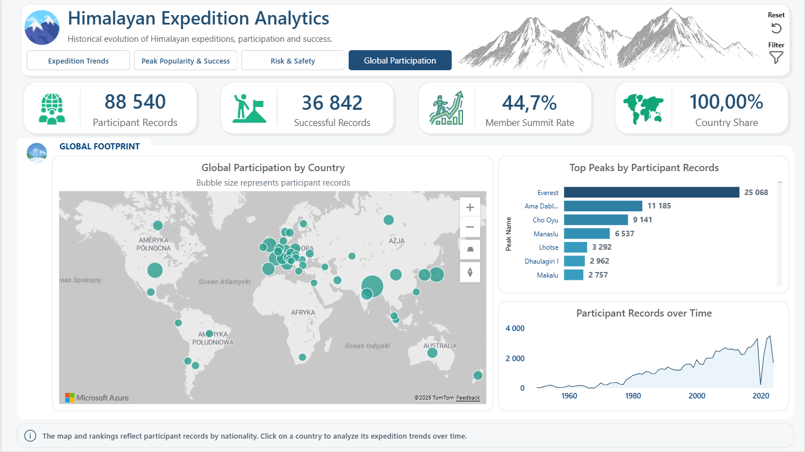

# Himalayan Expeditions Analytics Dashboard
A four-page Power BI dashboard exploring the historical development of Himalayan expeditions, peak popularity, expedition success, recorded risk, and the global participation of expedition members.

# Project Overview
**The project was created to answer four main questions:**  
- How has Himalayan expedition activity changed over time?    
- Which peaks attracted the most expeditions and achieved the highest success rates?    
- Which peaks combined expedition success with elevated recorded risk?    
- Where did registered expedition participants come from?    

**The final report contains four pages:**  
`Expedition Trends`      
`Peak Popularity & Success`    
`Risk & Safety`    
`Global Participation`    
# Key Insights
- **Expedition activity shifted toward larger teams.**  
Expedition volume peaked in 2009 with 420 expeditions and 2,865 participants. In contrast, participant volume peaked in 2023 with 4,379 participants across only 274 expeditions, increasing the average reported expedition size from approximately **6.8** to **16.0** participants.

- **Everest dominated expedition activity, while Ama Dablam combined popularity with strong success.**  
Everest accounted for 2,338 expeditions, representing 20.6% of all expedition activity. Ama Dablam ranked second with 1,576 expeditions and achieved the highest success rate among peaks with at least 30 expeditions, reaching 71.3%.

- **Absolute death counts and relative risk revealed different patterns.**  
Everest recorded the highest number of deaths, but Annapurna I and Dhaulagiri I had substantially higher relative death rates. Falls and avalanches were the two leading recorded causes of death above Base Camp, accounting for 331 and 322 deaths respectively. The highest Above-Base-Camp Death Rate by elevation was observed among peaks between 7,500 and 7,999 meters, showing that relative risk did not increase linearly with summit height.

- **Nepal dominated both participation and summit performance.**  
Nepal accounted for 20,704 participant records, representing 23.4% of the total, followed by the United States with 7,447 records and Japan with 6,604. Nepal also recorded 14,169 successful participant records and achieved a 69.4% Member Summit Rate, compared with approximately 31% to 38% among the other most represented countries. 

> The dataset ends in June 2024. Therefore, 2024 represents a partial year and should not be compared directly with complete calendar years. Participant records represent person-expedition entries rather than unique climbers
# Dashboard Preview

## 1. Expedition Trends


## 2. Peak Popularity & Success


## 3. Risk & Safety


## 4. Global Participation


# Tools and Technologies
- Power BI Desktop for data modelling, DAX, visualisation, bookmarks, navigation, and report interactions    
- Power Query for importing, cleaning, transforming, and validating source data    
- DAX for activity, success, participation, and risk measures    
- Performance Analyzer for visual performance testing    

# Data Preparation
The analytical model uses three main source tables:    
`Peaks`    
`Expeditions`    
`Members`        

Key preparation steps included:    
- Correcting CSV parsing    
- Selecting only fields required for the analysis    
- Assigning appropriate text, numeric, logical, and date types    
- Renaming source fields with clear business names    
- Creating a unique `ExpeditionKey`    
- Creating a `Years` dimension    
- Creating ordered `Season` and `Height Band` categories    
- Standardising country names for geographic mapping while preserving original citizenship values    

# Data Quality Decisions
Several data-quality issues required explicit decisions:    
- Four expedition identifiers were reused across different years, so relationships were not created using `Expedition ID` alone.    
- A composite `ExpeditionKey` was created using expedition identifier and year.    
- 89 member records without a safe expedition assignment were excluded from participant-level analysis.    
- 4 expedition records with inconsistent participant counts were retained but flagged and excluded from measures that depend on those counts.    
- Missing values were preserved as nulls and were not automatically replaced with zero.    
- Multiple, uncertain, or missing citizenship values were retained in the source field but excluded from geographic mapping.    
- Unique climbers were not estimated because the data does not contain a reliable global person identifier.    

# Data Model
The model follows a simple one-to-many structure:    

``Years[Year] 1 -> * Expeditions[Expedition Year]``    
``Peaks[Peak ID] 1 -> * Expeditions[Peak ID]``    
``Expeditions[ExpeditionKey] 1 -> * Members[ExpeditionKey]``    

All relationships are active and use single-direction filtering.    

# Business Definitions
## 1. Successful Expedition
An expedition is classified as successful when:    
- At least one recorded route was successful    
- The success was not marked as claimed but unrecognised    
- Disputed successes remained included    
## 2. Participant Record
One row in `Members` represents one registered person-expedition record. The same person may appear in multiple expeditions, so participant records are not treated as unique climbers.    
## 3. Above-Base-Camp Participant
A registered participant who:    
- Reached base camp    
- Was not restricted to base camp only    
- Conducted activity above base camp    
## 4. Member Summit Rate
```text
Successful Participant Records / Above-Base-Camp Participants
```
This denominator was selected instead of documented summit bids because it provides a broader and more interpretable population of participants exposed to higher-altitude activity.    
## 5. Above-Base-Camp Death Rate
```text
Recorded Deaths Above Base Camp / Above-Base-Camp Participants
```
The measure is an exposure-based recorded mortality rate. It should not be interpreted as the exact probability of death for an individual climber.    
## 6. Deaths per 100 Summits
```text
Total Deaths / Total Successful Summiters * 100
```
This ratio supports comparison with commonly reported mountaineering statistics. It is not a probability and may exceed 100 when deaths outnumber successful summit records.    
# Key Measures
## Activity
`Total Expeditions`    
`Total Members`    
`Total Hired Personnel`    
`Total Participants`    
`Participant Records`    
`Distinct Peaks Attempted`    
`Average Expedition Size`    
`Everest Expeditions`    
`Everest Share of Expeditions`    
## Success
`Successful Expeditions`    
`Expedition Success Rate`    
`Successful Participant Records`    
`Above-Base-Camp Participants`    
`Member Summit Rate`    
`Total Successful Summiters`    
`Distinct Peaks Successfully Climbed`    
## Risk
`Total Deaths`    
`Recorded Member Deaths`    
`Recorded Deaths Above Base Camp`    
`Above-Base-Camp Death Rate`    
`Deaths per 100 Summits`    
## Controls
`Peak Meets Minimum Expeditions`    
`Country Meets Minimum Participant Records`    
## Validation Results
Full-history validation values:    
```text
Total Expeditions: 11,425
Total Participants: 106,020
Successful Expeditions: 6,356
Expedition Success Rate: 55.6%
Member Summit Rate: 44.6%
Distinct Peaks Attempted: 416
Distinct Peaks Successfully Climbed: 363
Total Deaths: 1,158
Above-Base-Camp Death Rate: 1.25%
Deaths per 100 Summits: 3.11
```
The default report view is filtered to 1950-2024, while users can manually extend the range to earlier years.
# Report Pages
## Expedition Trends
Focuses on the historical development of Himalayan mountaineering:  
- Expeditions and participants over time    
- Successful expeditions and expedition success rate    
- Distinct peaks attempted and successfully climbed    
- Expedition activity by season    
## Peak Popularity & Success
Compares popularity, success, Everest activity, and peak elevation:    
- Most attempted peaks    
- Peak success overview with expedition volume    
- Everest expedition volume and share over time    
- Expeditions and success rate by height band    
- Dynamic minimum-expedition threshold for peak-level comparisons    
## Risk & Safety
Separates absolute fatalities from relative recorded risk:    
- Recorded deaths by cause    
- Success-versus-risk scatter plot by peak    
- Peak risk overview    
- Deaths and death rate by height band    
- Reference lines for overall expedition success and above-base-camp death rates    
## Global Participation
Uses the map as an interactive country selector:    
- Global participant distribution    
- Participant records and country share    
- Successful participant records and member summit rate    
- Most frequent peaks for the selected country    
- Participation trend for the selected country    
# User Experience Features
- Page navigator across all four report pages    
- Slide-out filter panels built with bookmarks and the Selection pane    
- Page-level reset buttons    
- Separate reset option inside each filter panel    
- Default year range of 1950-2024    
- Dynamic minimum sample thresholds for selected peak-level analysis    
- Custom report-page tooltips for peaks and countries    
- Controlled visual interactions to preserve analytical context    
# Limitations
- The same person may appear in multiple expeditions, so participant records are not unique climbers.  
- Detailed hired-personnel records may be less complete than expedition-level aggregates.  
- Some historical dates, birth years, summit-bid outcomes, and citizenship values are missing or uncertain.  
- Multiple citizenship values were excluded from map positioning to avoid arbitrary assignment or double counting.  
- `Deaths per 100 Summits` is a comparison ratio, not an individual probability of death.  
- Trends coinciding with external events should not be interpreted as causal without additional evidence.  
- The completeness of the latest year should be checked before interpreting end-of-series declines.  
# Performance
The report was tested with Power BI Performance Analyzer. Visuals loaded in under approximately 850 ms during testing.   
DAX query execution was fast, while most elapsed time was associated with visual rendering and other client-side operations.  


*Created by
Bartlomiej Czop*

