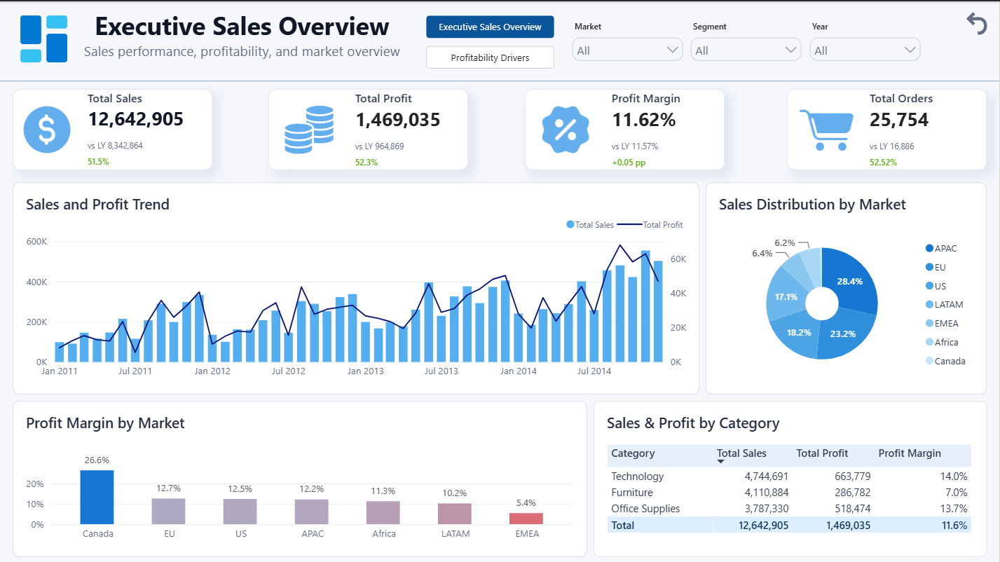
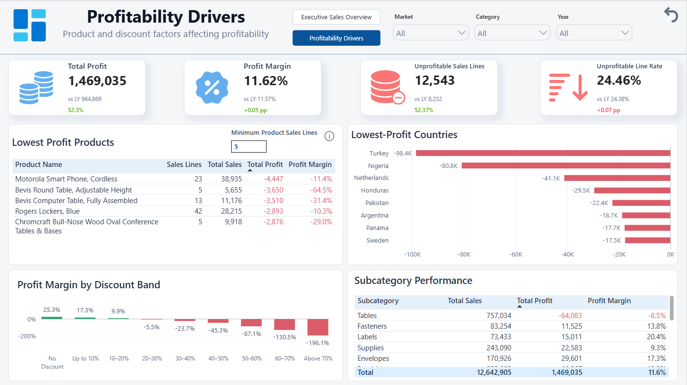
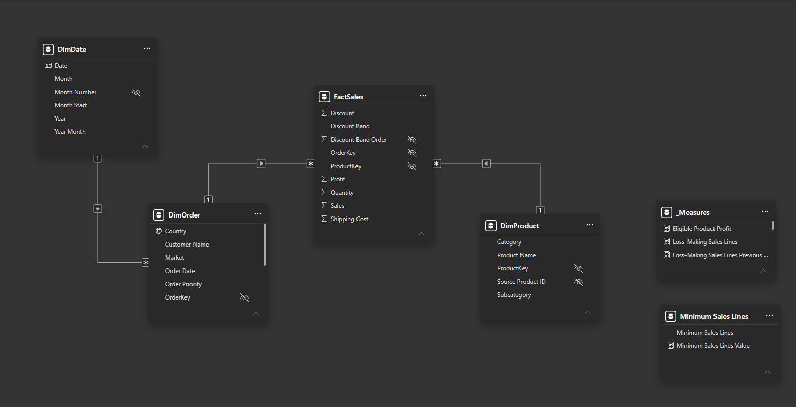

# Superstore Sales Analytics

A two-page Power BI report designed to evaluate sales performance, profitability, product results, market performance, and the relationship between discount levels and profit.

The report combines an executive overview with a focused profitability analysis, allowing users to move from high-level business results to specific categories, countries, discount bands, and products requiring attention.

# Table of Contents

- [Project Overview](#project-overview)
- [Key Insights](#key-insights)
- [Report Preview](#report-preview)
- [Tools and Technologies](#tools-and-technologies)
- [Data Preparation](#data-preparation)
- [Data Quality Decisions](#data-quality-decisions)
- [Data Model](#data-model)
- [Business Definitions](#business-definitions)
- [Key Measures](#key-measures)
- [Report Pages](#report-pages)
- [User Experience Features](#user-experience-features)
- [Limitations](#limitations)
- [Performance](#performance)
- [Data Source](#data-source)

# Project Overview
**The project was created to answer four main business questions:**    
- How did sales, profit, margin, and order volume change over time?
- Which markets and product categories generated the strongest results?
- Which products, countries, and subcategories reduced overall profitability?
- How did profitability differ across discount levels?

**The final report contains two pages:**

`Executive Sales Overview`    
`Profitability Drivers`    
  
The first page provides a concise management-level summary of business performance. The second page supports a more detailed analysis of loss-making sales lines, discounts, countries, subcategories, and products.

The dataset covers sales recorded between January 1, 2011, and December 31, 2014.

# Key Insights

- **Sales, profit, and order volume increased in every year covered by the dataset.**  
Sales grew from **2.26M** in 2011 to **4.30M** in 2014, while profit increased from **248.9K** to **504.2K**. Order volume rose from **4,516** to **8,868**, while the annual profit margin remained relatively stable between **11.0%** and **12.0%.**

- **Furniture combined high sales with substantially weaker profitability.**  
The category generated 4.11M in sales, approximately **323.6K more** than Office Supplies, but delivered only **286.8K in profit** compared with 518.5K for Office Supplies. Its 7.0% profit margin was almost half the 13.7% achieved by Office Supplies. Furniture also recorded the highest **loss-making sales line rate** at **31.55%**, compared with 23.90% for Technology and 22.39% for Office Supplies.

- **Profitability declined sharply as discount levels increased.**  
Sales lines without a discount generated 6.99M in sales and 1.77M in profit at a 25.3% margin. In contrast, discount bands above 20% generated approximately 1.93M in sales but produced a combined loss of approximately 814.7K, equivalent to a margin of around -42.2%. The aggregated result **became negative in the 20–30% discount band** and **deteriorated further at higher discount levels.**

- **Country-level losses were heavily concentrated in Turkey and Nigeria, where every recorded sales line was unprofitable.**  
Together, the two countries generated 162.9K in sales but recorded a combined **loss of 179.2K**, resulting in an aggregated margin of approximately -110.0%. All 1,378 sales lines in Turkey fell within the 50–60% discount band, while all 905 sales lines in Nigeria fell within the 60–70% band. **Their combined loss was almost twice** the approximately 93.0K recorded across the next three lowest-profit countries: the Netherlands, Honduras, and Pakistan.

# Report Preview

## 1. Executive Sales Overview

The page presents:

- Total sales, profit, profit margin, and order volume
- Previous-year values and year-over-year changes
- Monthly sales and profit trends
- Sales distribution by market
- Profit margin by market
- Sales, profit, and margin by product category

## 2. Profitability Drivers

The page presents:

- Total profit and profit margin
- Loss-making sales lines and their share of all sales lines
- Products producing the lowest profit
- Countries generating the largest losses
- Profit margin by discount band
- Sales, profit, and margin by product subcategory
- A dynamic minimum sales-line threshold for the product ranking

# Tools and Technologies

- **Power BI Desktop** for data modelling, DAX, report design, navigation, interactions
- **Power Query** for importing, cleaning, transforming, and validating source data
- **DAX** for sales, profit, margin, order, year-over-year, loss-making sales line measures
- **Performance Analyzer** for visual performance testing  

# Data Preparation

The source consists of one CSV file containing 51,290 sales lines and 21 source columns.

The preparation process included:

- Importing the source CSV file to staging query
- Assigning appropriate data types and standardising source field names
- Creating a continuous date dimension covering the full reporting period
- Grouping discount values into ordered analytical bands
- Restructuring the source file into separate `DimOrder`, `DimProduct`, and `FactSales` tables
- Resolving non-unique source identifiers by identifying orders through `Order ID + Order Date + Customer Name` and products through `Product ID + Product Name`
- Assigning numeric `OrderKey` and `ProductKey` surrogate keys and using them to build one-to-many model relationships
- Disabling load for the staging query and hiding technical fields from Report view

The final analytical model contains four tables:

- `DimDate`
- `DimOrder`
- `DimProduct`
- `FactSales`

# Data Quality Decisions

Several source-data issues required explicit decisions.

## Reused Order Identifiers

The source `order_id` was not globally unique:

- 25,035 distinct source order IDs were found.
- 659 source order IDs appeared on more than one order date.
- Two additional cases shared the same order ID and order date but belonged to different customers.

Orders were therefore identified using the combination of:

`Order ID + Order Date + Customer Name`

A numeric `OrderKey` was assigned to the resulting 25,754 identified orders.

## Reused Product Identifiers

The source `product_id` did not uniquely identify every product name.

Products were identified using the combination of:

`Product ID + Product Name`

A numeric `ProductKey` was assigned to 10,768 identified source product combinations.

## Missing Values and Duplicates

- No missing or blank values were identified in the source file.
- No exact duplicate rows were found.
- Thirty-five order-product combinations appeared more than once.
- These rows had different sales, quantity, discount, profit, or shipping cost values.

The repeated order-product combinations were retained because the dataset does not provide a reliable order-line identifier that would justify removing them.

## Numeric and Date Validation

- All sales, quantity, discount, profit, and shipping cost values were converted without errors.
- All order and shipping dates were converted successfully.
- No shipping date occurred before its related order date.
- The source year field was consistent with the year derived from the order date.
- Negative profit values were retained as valid loss-making sales outcomes.

# Data Model

The model separates order-level attributes, product attributes, daily calendar values, and line-level financial results.

The active relationships are:

- `DimDate[Date]` 1 → * `DimOrder[Order Date]`
- `DimOrder[OrderKey]` 1 → * `FactSales[OrderKey]`
- `DimProduct[ProductKey]` 1 → * `FactSales[ProductKey]`

All relationships are active and use single-direction filtering.

The filter flow is:

`DimDate → DimOrder → FactSales ← DimProduct`

The `Minimum Sales Lines` parameter table is intentionally disconnected. Its selected value is used by a DAX measure that controls product eligibility in the lowest-profit product ranking.

# Business Definitions

## 1. Sales Line

One row in `FactSales` represents one recorded product line within an identified order.

Sales lines are not equivalent to orders because one order can contain multiple product lines.

## 2. Order

An order is identified using the combination of:

`Source Order ID + Order Date + Customer Name`

A numeric `OrderKey` is assigned to each identified order and used by the `Total Orders` measure.

## 3. Total Sales

The sum of the source `Sales` values recorded across sales lines in the current filter context.

The source does not specify a currency, so the report does not apply a currency symbol.

## 4. Total Profit

The sum of the source `Profit` values recorded across sales lines in the current filter context.

Shipping cost is not subtracted again because the source documentation does not confirm whether shipping cost is already reflected in the provided profit value.

## 5. Profit Margin

`Total Profit / Total Sales`

The measure evaluates profitability relative to sales value and can be negative when total profit is below zero.

## 6. Loss-Making Sales Line

A sales line is classified as loss-making when:

`Profit < 0`

Lines with zero profit are not classified as loss-making.

## 7. Loss-Making Sales Line Rate

`Loss-Making Sales Lines / Sales Lines`

The measure represents the share of line-level sales records generating a negative profit. It does not represent the share of loss-making orders or products.

## 8. Discount Band

Discounts are grouped into the following analytical ranges:

- No Discount
- Up to 10%
- 10–20%
- 20–30%
- 30–40%
- 40–50%
- 50–60%
- 60–70%
- Above 70%

The highest ranges were combined into `Above 70%` because the original band above 80% contained only two sales lines and substantially distorted the visual scale.

## 9. Eligible Product

A product is eligible for the lowest-profit ranking when its number of sales lines is greater than or equal to the selected `Minimum Sales Lines` parameter value.

The default threshold is five sales lines.

# Key Measures

## Core Performance

- `Total Sales`
- `Total Profit`
- `Profit Margin`
- `Total Orders`
- `Total Quantity`
- `Sales Lines`

## Previous-Year Comparisons

- `Sales Previous Year`
- `Sales YoY Growth`
- `Profit Previous Year`
- `Profit YoY Growth`
- `Total Orders Previous Year`
- `Total Orders YoY Growth`
- `Profit Margin Previous Year`
- `Profit Margin YoY Growth`

## Loss-Making Sales Lines

- `Loss-Making Sales Lines`
- `Loss-Making Sales Lines Previous Year`
- `Loss-Making Sales Lines Rate`
- `Loss-Making Sales Lines Rate Previous Year`
- `Loss-Making Sales Lines YoY Growth`
- `Loss-Making Sales Lines Rate YoY Growth`

## Product Ranking and Controls

- `Eligible Product Profit`
- `Minimum Sales Lines Value`

## Full-History Validation Results

- **Total Sales:** 12,642,905
- **Total Profit:** 1,469,034.82
- **Profit Margin:** 11.62%
- **Total Orders:** 25,754
- **Total Quantity:** 178,312
- **Sales Lines:** 51,290
- **Loss-Making Sales Lines:** 12,543
- **Loss-Making Sales Line Rate:** 24.46%

# Report Pages

## Executive Sales Overview

The page is designed for a manager or director who needs a concise summary of business performance.

It includes:

- Sales, profit, margin, and order KPI cards
- Previous-year results and growth indicators
- Monthly sales and profit development
- Sales distribution across markets
- Market-level profit margin comparison
- Category-level sales, profit, and margin results
- Market, segment, and year filters

## Profitability Drivers

The page supports a more detailed investigation of low-profit and loss-making areas.

It includes:

- Profit and loss-making line KPI cards
- Lowest-profit product ranking
- Minimum product sales-line parameter
- Lowest-profit country ranking
- Profit margin by discount band
- Subcategory sales, profit, and margin results
- Market, category, and year filters

The product ranking uses `Eligible Product Profit` to select the five products with the lowest profit among products meeting the selected minimum sales-line threshold.

# User Experience Features

- Two-page navigation using a page navigator
- Reset button on each report page
- Consistent page structure, typography, icons, and colour usage
- Dropdown slicers for market, segment, category, and year
- Cross-filtering between analytical visuals
- Dynamic previous-year and year-over-year KPI comparisons
- Dynamic minimum sales-line threshold for the product ranking
- Tooltip explaining the purpose of the product threshold
- Hidden technical keys and sorting columns
- Continuous monthly date axis with an English report locale

The reset buttons restore:

- All main filters to `All`
- Visual selections to the default state
- `Minimum Product Sales Lines` to its default value of five

# Limitations

- The dataset does not specify a currency, so monetary values are presented without a currency symbol.
- Profit is used as supplied by the source. Shipping cost is not subtracted separately because the source does not confirm whether it is already included in the profit calculation.
- The dataset does not contain a reliable source order-line identifier.
- Order and product surrogate keys were created inside Power Query for this static portfolio dataset. In a production environment, persistent surrogate keys would normally be managed in a database or data warehouse.
- Product rankings depend on the selected minimum sales-line threshold.
- Relationships between discount levels and profitability are observational and should not be interpreted as proof of causation.
- Previous-year measures shift the entire selected date context back by one year. Their clearest year-over-year interpretation is obtained when a single year is selected.
- The report uses customer names as source attributes and does not attempt to establish whether identical names always represent the same real-world customer.
- Results describe the historical records included in the dataset and do not represent forecasts.

# Performance

The report was tested using Power BI Performance Analyzer.

All visuals loaded in under approximately 420 ms during testing. The two detailed tables recorded the longest loading times:

- `Subcategory Performance`: approximately 417 ms
- `Lowest Profit Products`: approximately 401 ms

No report visual required additional performance optimisation.

# Data Source

This project uses the **SuperStore Sales Analytics** dataset published on Kaggle by Đào Minh Thuận.

- **Dataset:** [SuperStore Sales Analytics](https://www.kaggle.com/datasets/thuandao/superstore-sales-analytics)
- **Source-file documentation:** [data/README.md](data/README.md)
- **Dataset licence:** [data/LICENSE](data/LICENSE)

The source dataset is distributed under the Apache License 2.0.

The Power BI report, analytical model, Power Query transformations, DAX measures, documentation, and visual design were created specifically for this portfolio project.

---

_Created by Bartłomiej Czop_

[LinkedIn](https://www.linkedin.com/in/bartlomiej-czop/) · [Portfolio](https://rezzt-93.github.io/index.html) · [Email](mailto:bartlomiej.czop1@gmail.com)
