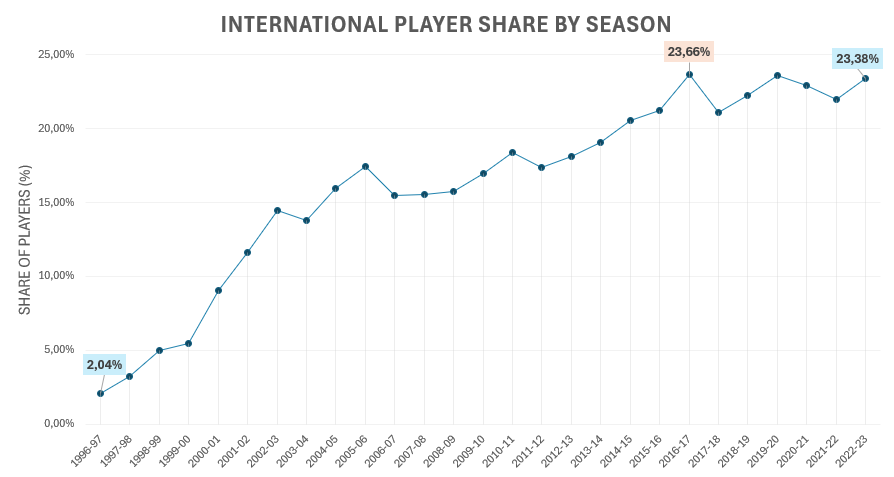

# NBA Players SQL Data Exploration

An SQL data exploration project analyzing NBA player records across 27 seasons, from 1996-97 to 2022-23.

The project demonstrates the practical use of SQL to answer analytical questions, aggregate season-level data, create player rankings, compare first-round draft positions, and examine the growth of international representation in the NBA.

# Table of Contents

- [Project Overview](#project-overview)
- [Dataset](#dataset)
- [Tools and SQL Skills](#tools-and-sql-skills)
- [Database Setup](#database-setup)
- [Analysis](#analysis)
  - [Dataset Overview](#1-dataset-overview)
  - [Season Leaders](#2-season-leaders)
  - [Draft Position Analysis](#3-draft-position-analysis)
  - [International Players](#4-international-players)
- [Key Findings](#key-findings)
- [Repository Structure](#repository-structure)
- [Limitations](#limitations)
- [Data Source](#data-source)

# Project Overview

**The goal of this project is to demonstrate practical SQL skills by exploring NBA player data and answering structured analytical questions.**

The analysis focuses on four areas:

- The number of player records and the time range covered by the dataset    
- Season leaders based on combined points, rebounds, and assists per game    
- Scoring patterns across first-round draft positions   
- The long-term growth of international representation   

The project uses season-level data covering 27 NBA seasons, from 1996-97 through 2022-23.    

# Dataset

**The dataset contains season-level NBA player records covering 27 seasons, from 1996-97 through 2022-23.**

**Each record includes information about:**

`Player name, age, height, and weight`    
`Team and season`    
`College and country`    
`Draft year, round, and number`    
`Games played`    
`Points, rebounds, and assists per game`    
`Selected advanced performance metrics`    
    
The source CSV contains 12,844 records and 22 columns.
    
> The original CSV index was stored as `player_index` and used as the primary key for individual rows. A separate `player_id` was generated using `DENSE_RANK()` based on `player_name`, `college`, and `draft_year`. The identifier was created to support player-level aggregation across multiple seasons and to distinguish players with identical names.

# Tools and SQL Skills

## Tools

- **SQL** for data exploration, aggregation, ranking, and trend analysis    
- **MySQL Workbench** as the database environment used to execute the queries    
- **CSV** files for source data and query results    

## SQL Skills Demonstrated

- Data filtering with `WHERE`
- Aggregation with `COUNT()`, `AVG()`, `MIN()`, and `MAX()`
- Grouping and aggregated filtering with `GROUP BY` and `HAVING`
- Sorting and limiting results with `ORDER BY` and `LIMIT`
- Common Table Expressions using `WITH`
- Combining query results with `LEFT JOIN` and `CROSS JOIN`
- Window functions using `RANK()` and `PARTITION BY`
- Percentage and ranking calculations
- Creation of a player-level identifier using `DENSE_RANK()`

# Database Setup

The source CSV was imported into the `nba_players` table. The original CSV index was stored as `player_index` and used as the primary key for individual records.

A separate `player_id` was generated using `DENSE_RANK()` based on:

- `player_name`
- `college`
- `draft_year`

The identifier was used to support player-level aggregation across seasons and to distinguish records with identical player names.

The complete table creation and identifier logic are available in [`sql/01_database_setup.sql`](sql/01_database_setup.sql).

# Analysis

## 1. Dataset Overview

The first queries established the scope of the analysis and compared the number of player records across seasons.

The dataset covers:

- **27 NBA seasons**
- **First season:** 1996-97
- **Last season:** 2022-23
- **12,844 season-level player records**

The number of player records increased from **441 in 1996-97** to a peak of **605 in 2021-22**. The final season included in the dataset, 2022-23, contained **539 player records**.

The full SQL queries are available in [`sql/02_dataset_overview.sql`](sql/02_dataset_overview.sql), while the season-level results are stored in [`results/players_by_season.csv`](results/players_by_season.csv).

## 2. Season Leaders

A ranking query was used to identify the player with the highest combined points, rebounds, and assists per game in each season.

The query uses:

- CTE (Common Table Expressions)
- `RANK()`
- `PARTITION BY`
- Season-level aggregation

Selected results include:
```text
1996-97: Shaquille O'Neal, 41.8 combined average    
2007-08: LeBron James, 45.1    
2016-17: Russell Westbrook, 52.7    
2020-21: Nikola Jokic, 45.5    
2022-23: Luka Doncic, 49.0    
```
Russell Westbrook recorded the highest season-leading combined average in the dataset, reaching **52.7 combined points, rebounds, and assists per game in 2016-17**.

The complete query is available in [`sql/03_season_leaders.sql`](sql/03_season_leaders.sql), and the full results are stored in [`results/season_leaders.csv`](results/season_leaders.csv).

## 3. Draft Position Analysis

The analysis compared average scoring performance across first-round draft positions.
 
Player-season records associated with the first overall draft pick produced the highest average scoring result at **16.46 points per game**. However, the results did not decline consistently with each subsequent draft position.

This suggests that earlier draft positions were generally associated with stronger scoring results, although the relationship was not strictly linear.

The complete queries are available in [`sql/04_draft_position_analysis.sql`](sql/04_draft_position_analysis.sql), and the results are stored in [`results/draft_position_results.csv`](results/draft_position_results.csv).

## 4. International Players

The international player analysis examined how the number and percentage of players recorded outside the USA changed across the available seasons.

### Growth Across Seasons

    

The analysis examined how the share of players recorded outside the USA changed across the available seasons.

International representation increased substantially over time:
```text
- 1996-97: 9 players, representing 2.04%    
- 2005-06: 80 players, representing 17.47%    
- 2016-17: 115 players, representing 23.66%    
- 2022-23: 126 players, representing 23.38%    
```
The percentage increased across most of the analyzed period, despite occasional season-to-season declines. By 2022-23, players recorded outside the USA represented nearly one-quarter of all player records, compared with only 2.04% in 1996-97.

> Note: Player countries follow the classifications provided in the source dataset.

The complete queries are available in [`sql/05_international_players.sql`](sql/05_international_players.sql). The results are stored in [`results/international_players_by_season.csv`](results/international_players_by_season.csv).

# Key Findings

- **International representation increased substantially.**    
  Players recorded outside the USA represented 2.04% of player records in 1996-97 and 23.38% in 2022-23. The increase occurred across most of the analyzed period, indicating a clear long-term shift toward a more international league.
 
- **International players represented nearly one-quarter of the league by the end of the analyzed period.**    
  Their share reached 23.38% in 2022-23, compared with only 2.04% in the first analyzed season.
 
- **The first overall draft position produced the highest scoring average among first-round positions.**    
   Player-season records associated with the first pick averaged 16.46 points per game. However, scoring averages did not decline consistently with each subsequent draft position.
 
- **Draft position and scoring performance did not follow a strictly linear relationship.**    
  Several later first-round positions recorded higher averages than positions selected immediately before them.
 
- **Russell Westbrook recorded the highest season-leading combined average.**    
  Combined points, rebounds, and assists reached 52.7 per game in the 2016-17 season.

# Repository Structure

```text
nba-sql-data-exploration/
|
|-- README.md
|
|-- data/
|   `-- all_seasons.csv
|
|-- images/
|  `-- international-player-share-by-season.png
|
|-- sql/
|   |-- 01_database_setup.sql
|   |-- 02_dataset_overview.sql
|   |-- 03_season_leaders.sql
|   |-- 04_draft_position_analysis.sql
|   `-- 05_international_players.sql
|
`-- results/
    |-- players_by_season.csv
    |-- season_leaders.csv
    |-- draft_position_results.csv
    `-- international_players_by_season.csv
```

- `data/` contains the source dataset used in the analysis.
- `sql/` contains the database setup and analytical SQL queries.
- `results/` contains the query results used to support the findings presented in this README.

# Limitations

- The dataset covers the 1996-97 through 2022-23 seasons and does not represent the complete history of the NBA.
- Player statistics are recorded as season-level averages rather than game-level results.
- The `country` column follows the classifications provided in the source dataset.
- Draft position and scoring performance may be related, but this descriptive analysis does not establish a causal relationship.
- A generated `player_id` based on player name, college, and draft year was used during the original analysis.
- College names were not standardized in the source data. College-level results were therefore excluded from the main findings.
- Career-level scoring rankings dependent on the generated identifier were excluded from the main findings.

# Data Source

This project uses the **NBA Players** dataset published on Kaggle. The dataset contains biographic information and season-level player statistics covering the 1996-97 through 2022-23 seasons.

- **Source file:** `all_seasons.csv`
- **Dataset:** [NBA Players Data on Kaggle](https://www.kaggle.com/datasets/justinas/nba-players-data/data)
- **Rows:** 12,844
- **Columns:** 22

The source CSV is included in the `data/` folder.

_Created by Bartłomiej Czop_

[LinkedIn](https://www.linkedin.com/in/bartlomiej-czop/) · [Portfolio](https://rezzt-93.github.io/index.html) · [Email](mailto:bartlomiej.czop1@gmail.com)
